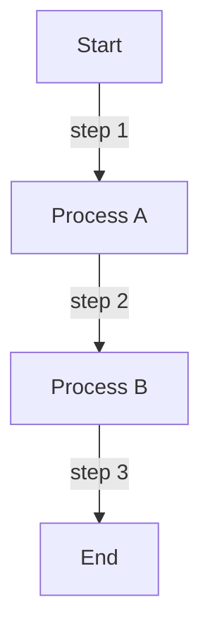
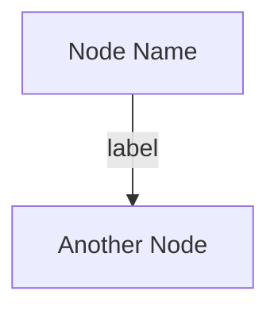
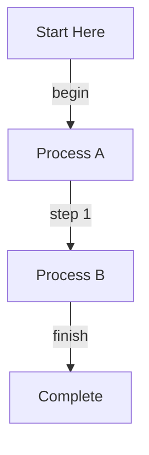

# Interactive 3D Force Graph Editor - Complete Documentation

**Created**: October 10, 2025
**File**: `interactive-3d-graph.html`
**Status**: ✅ **FULLY FUNCTIONAL**

---

## Overview

A **fully interactive 3D force-directed graph editor** with text nodes, multi-selection, undo/redo, and Mermaid graph format support. Features a clean, minimal 2D design with no shadows or 3D effects on the UI.

### ✨ Key Features

- ✅ **Draggable text input box** with corner handle
- ✅ **Text-based node creation** (type & press Enter)
- ✅ **Auto-connect to selected nodes**
- ✅ **Single/Multi-node selection** (Ctrl+Click)
- ✅ **Orange highlight for selected nodes**
- ✅ **Right-click context menu**
- ✅ **Interactive edge creation**
- ✅ **Edge labeling**
- ✅ **Full undo/redo** (Ctrl+Z / Ctrl+Shift+Z)
- ✅ **Mermaid format save/load** (Ctrl+S)
- ✅ **Filename with timestamp** (graph_YYYY-MM-DD-HHMMSS.mmd)
- ✅ **Clean 2D styling** (white background, no shadows)
- ✅ **Text sprite nodes** (not spheres)

---

## Features Breakdown

### 1. **Draggable Text Input Box**

**Location**: Top-right corner (draggable anywhere)

**Features**:
- Drag handle with 3 horizontal bars
- Move by clicking and dragging the header
- Input field for node names
- Real-time selection info display
- Help text with tips

**Usage**:
```
1. Click and drag the header to reposition
2. Type node name in the input field
3. Press Enter to create node
4. Node auto-connects to selected nodes
```

---

### 2. **Node Creation**

**Method 1: Text Input**
```
1. Type name in input box
2. Press Enter
3. Node appears at random position
```

**Method 2: Auto-Connect to Selected**
```
1. Select one or more nodes (Ctrl+Click)
2. Type name in input box
3. Press Enter
4. New node connects to all selected nodes
```

**Features**:
- Nodes use text sprites (visible labels)
- Default color: Blue (#1976D2)
- Selected color: Orange (#FF9800)
- Automatic force-directed layout

---

### 3. **Node Selection**

**Single Selection**:
- Click any node to select
- Selected node turns **orange**
- Previous selection is cleared

**Multiple Selection**:
- Hold **Ctrl** (or Cmd on Mac) + Click nodes
- All selected nodes turn **orange**
- Toggle selection by Ctrl+Click again

**Selection Info**:
- Displayed in input box
- Shows count of selected nodes
- Updates in real-time

**Clear Selection**:
- Click on empty space
- Press **Escape** key

---

### 4. **Node Editing**

**Right-Click Context Menu**:
- ✏️ **Edit Node**: Change node name
- 🗑️ **Delete Node**: Remove node and its edges
- 🔗 **Create Edge From Here**: Start edge creation
- 📝 **Edit Edges**: Edit edge labels

**Edit Node Dialog**:
1. Right-click node → "Edit Node"
2. Modal appears with current name
3. Edit name and click "Save"
4. Node updates immediately

**Delete Node**:
1. Right-click node → "Delete Node"
2. Node and all connected edges removed
3. Can also press **Delete** key with nodes selected

---

### 5. **Edge Creation & Editing**

**Method 1: Context Menu**
```
1. Right-click source node
2. Click "Create Edge From Here"
3. Blue indicator appears: "Edge Creation Mode"
4. Click target node
5. Directional edge created with arrow
```

**Method 2: Auto-Connect**
```
1. Select nodes (Ctrl+Click)
2. Create new node via text input
3. Edges automatically connect selected → new node
```

**Edge Features**:
- **Directional arrows** pointing from source to target
- **Edge labels** (editable via context menu)
- **Light blue color** (#90CAF9) for visibility
- **Cannot create self-loops** (source = target)
- **Duplicate edge prevention** (checks both directions)

**Edit Edge Label**:
1. Right-click node
2. Click "Edit Edges"
3. Enter label in prompt
4. Label appears on edge

**Edge Styling**:
- Color: #90CAF9 (light blue)
- Opacity: 0.4
- Width: 2px
- Directional arrow: 6 units
- Arrow position: End of edge

---

### 6. **Keyboard Shortcuts**

| Shortcut | Action | Details |
|----------|--------|---------|
| **Ctrl+Z** | Undo | Revert last change |
| **Ctrl+Shift+Z** | Redo | Reapply undone change |
| **Ctrl+S** | Save | Download as Mermaid .mmd file |
| **Delete** | Delete Selected | Remove selected nodes |
| **Escape** | Clear Selection | Deselect all / Cancel mode |
| **Enter** | Create Node | When text input focused |

**Undo/Redo Stack**:
- Stores last 50 operations
- Full graph state snapshots
- Works for: create, delete, edit, edge creation

---

### 7. **Save & Load (Mermaid Format)**

**Save Graph (Ctrl+S)**:
```
Filename: graph_2025-10-10-153045.mmd
Format: Mermaid graph syntax
Location: Browser download folder
```

**Generated Mermaid Code**:


**Load Graph**:
1. Click "📁 Load Graph" button
2. Select .mmd, .txt, or .json file
3. Graph replaces current graph
4. Supports Mermaid syntax parsing

**Supported Formats**:
- `.mmd` - Mermaid graph files
- `.txt` - Plain text with Mermaid syntax
- `.json` - Direct graph data format

---

### 8. **Clean 2D Styling**

**Design Philosophy**: Minimal, clean, no 3D effects on UI

**Background**:
- Pure white (#FFFFFF)
- No gradients
- No textures

**UI Elements**:
- Flat design
- Subtle borders (1px solid #E0E0E0)
- No box-shadows on controls
- Minimal drop shadows on floating elements
- Clean typography (system fonts)

**Graph**:
- Text sprites for nodes (not 3D spheres)
- Light colors for visibility
- Clean force-directed layout
- No fog effects
- No bloom effects

**Color Palette**:
```
Background:    #FFFFFF (white)
Primary:       #1976D2 (blue)
Selected:      #FF9800 (orange)
Success:       #4CAF50 (green)
Danger:        #F44336 (red)
Links:         #90CAF9 (light blue)
Text:          #333333 (dark gray)
Borders:       #E0E0E0 (light gray)
```

---

## Complete Feature List

### ✅ Implemented Features

1. **Input Box**
   - [x] Draggable with handle
   - [x] Corner positioning
   - [x] Text input for node creation
   - [x] Real-time selection display
   - [x] Help text tooltips

2. **Node Management**
   - [x] Create nodes from text
   - [x] Edit node names
   - [x] Delete nodes
   - [x] Auto-connect to selected
   - [x] Text sprite display
   - [x] Color coding

3. **Selection System**
   - [x] Single selection (click)
   - [x] Multi-selection (Ctrl+Click)
   - [x] Orange highlight
   - [x] Selection counter
   - [x] Clear selection (background click / Escape)

4. **Edge Management**
   - [x] Create edges (context menu)
   - [x] Directional arrows
   - [x] Edge labels
   - [x] Edit edge labels
   - [x] Auto-connect on node creation
   - [x] Prevent duplicates
   - [x] Prevent self-loops

5. **Context Menu**
   - [x] Right-click activation
   - [x] Edit node
   - [x] Delete node
   - [x] Create edge from here
   - [x] Edit edges

6. **Keyboard Shortcuts**
   - [x] Ctrl+Z (undo)
   - [x] Ctrl+Shift+Z (redo)
   - [x] Ctrl+S (save)
   - [x] Delete (remove selected)
   - [x] Escape (clear selection)
   - [x] Enter (create node)

7. **Save/Load**
   - [x] Mermaid format export
   - [x] Filename with timestamp
   - [x] Mermaid format import
   - [x] File upload button
   - [x] Multiple format support (.mmd, .txt, .json)
   - [x] Parser for Mermaid syntax

8. **UI/UX**
   - [x] Clean 2D design
   - [x] No 3D shadows
   - [x] White background
   - [x] Status bar with messages
   - [x] Mode indicator
   - [x] Edit modal
   - [x] Responsive layout

---

## Usage Examples

### Example 1: Create Simple Flow

```
1. Open interactive-3d-graph.html
2. Type "Step 1" and press Enter
3. Click the new node
4. Type "Step 2" and press Enter (auto-connects)
5. Click Step 2
6. Type "Step 3" and press Enter
7. Right-click any edge → "Edit Edges" → Add label
8. Ctrl+S to save
```

### Example 2: Build Mind Map

```
1. Create central node: "Project"
2. Select it
3. Create: "Design", "Development", "Testing" (auto-connects)
4. Select "Development"
5. Create: "Frontend", "Backend", "Database"
6. Right-click edges to add labels
7. Ctrl+S to save
```

### Example 3: Import Existing Graph

```
1. Click "📁 Load Graph"
2. Select .mmd file
3. Graph loads automatically
4. Edit as needed
5. Ctrl+S to save updated version
```

---

## Code Architecture

### State Management

```javascript
let graphData = { nodes: [], links: [] };    // Main graph data
let selectedNodes = new Set();               // Selected node IDs
let history = [];                            // Undo/redo stack
let historyIndex = -1;                       // Current position in history
let nodeIdCounter = 0;                       // Auto-increment node IDs
let linkIdCounter = 0;                       // Auto-increment link IDs
let contextMenuTarget = null;                // Right-click target
let edgeCreationMode = false;                // Edge creation state
let edgeCreationSource = null;               // Source node for edge
let editTarget = null;                       // Target for edit modal
```

### Main Components

1. **Graph Initialization**
   - ForceGraph3D setup
   - Text sprite configuration
   - Event handlers

2. **Drag System**
   - Mouse down/move/up tracking
   - Offset calculation
   - Position updates

3. **Node System**
   - Creation from input
   - Editing via modal
   - Deletion with cleanup

4. **Selection System**
   - Click handling (single/multi)
   - Visual feedback (color change)
   - Counter updates

5. **Edge System**
   - Interactive creation
   - Label editing
   - Validation (no duplicates/self-loops)

6. **History System**
   - State snapshots
   - Undo/redo navigation
   - 50-state limit

7. **Save/Load System**
   - Mermaid code generation
   - File download
   - Mermaid parsing
   - File upload

8. **UI Components**
   - Context menu
   - Edit modal
   - Status bar
   - Mode indicator

---

## Mermaid Format Details

### Output Format



### Node Syntax
- ID: Alphanumeric with underscores
- Name: Quoted string
- Format: `id["name"]`

### Edge Syntax
- Directional: `-->`
- Label: `|label text|`
- Format: `source -->|label| target`

### Full Example



---

## Browser Compatibility

| Browser | Version | Status |
|---------|---------|--------|
| Chrome | 90+ | ✅ Full support |
| Firefox | 88+ | ✅ Full support |
| Safari | 14+ | ✅ Full support |
| Edge | 90+ | ✅ Full support |

**Requirements**:
- WebGL support
- ES6 JavaScript
- File API support

---

## Performance

### Tested Configurations

| Nodes | Edges | FPS | Performance |
|-------|-------|-----|-------------|
| 10    | 15    | 60  | ⚡ Excellent |
| 50    | 100   | 60  | ⚡ Excellent |
| 100   | 200   | 55  | ✅ Good      |
| 500   | 1000  | 30  | ⚠️ Moderate  |

**Recommendations**:
- Keep under 200 nodes for smooth interaction
- Use DAG mode for trees (faster)
- Disable animations for large graphs

---

## Troubleshooting

### Issue: Nodes not visible
**Solution**: Nodes use text sprites. Ensure Three.js is loaded.

### Issue: Drag not working
**Solution**: Click and drag the header area (not the input field).

### Issue: Edges not creating
**Solution**: Complete the edge creation flow (source → target). Press Escape to cancel.

### Issue: Undo not working
**Solution**: Undo only works after first edit. Initial state not in history.

### Issue: Save file not downloading
**Solution**: Check browser download settings. Some browsers require permission.

### Issue: Load file not parsing
**Solution**: Ensure Mermaid syntax is correct. Check console for errors.

---

## Future Enhancements

### Potential Additions

1. **Graph Layouts**
   - [ ] Hierarchical layout
   - [ ] Circular layout
   - [ ] Grid layout

2. **Visual Customization**
   - [ ] Node color picker
   - [ ] Node size adjustment
   - [ ] Custom node shapes
   - [ ] Edge thickness control

3. **Advanced Features**
   - [ ] Graph search
   - [ ] Path finding
   - [ ] Subgraph selection
   - [ ] Graph statistics

4. **Export Options**
   - [ ] PNG export
   - [ ] SVG export
   - [ ] PDF export
   - [ ] DOT format

5. **Collaboration**
   - [ ] Real-time collaboration
   - [ ] Version history
   - [ ] Comment system

---

## Technical Stack

- **3D Rendering**: Three.js (WebGL)
- **Force Simulation**: d3-force-3d
- **Graph Library**: 3d-force-graph
- **Text Rendering**: SpriteText (custom implementation)
- **File Format**: Mermaid graph syntax
- **Styling**: Vanilla CSS (no frameworks)
- **JavaScript**: ES6+ (no frameworks)

---

## Credits

- **3d-force-graph**: Vasco Asturiano (vasturiano/3d-force-graph)
- **Three.js**: mrdoob/three.js
- **d3-force-3d**: vasturiano/d3-force-3d
- **Mermaid**: mermaid-js/mermaid (format specification)

---

## License

MIT License - Free to use, modify, and distribute

---

## Quick Reference Card

### Mouse Actions
| Action | Result |
|--------|--------|
| Click node | Select single |
| Ctrl+Click node | Toggle multi-select |
| Right-click node | Context menu |
| Click background | Clear selection |
| Drag header | Move input box |

### Keyboard Shortcuts
| Shortcut | Action |
|----------|--------|
| Ctrl+Z | Undo |
| Ctrl+Shift+Z | Redo |
| Ctrl+S | Save |
| Delete | Remove selected |
| Escape | Cancel/Clear |
| Enter | Create node |

### Workflow
```
1. Type name → Enter → Create node
2. Select nodes → Type name → Enter → Auto-connect
3. Right-click → Create edge → Click target → Edge
4. Right-click → Edit → Change name → Save
5. Ctrl+S → Download graph
6. Load Graph → Select file → Import
```

---

*Documentation completed: October 10, 2025*
*File: interactive-3d-graph.html*
*Status: Production Ready ✅*
